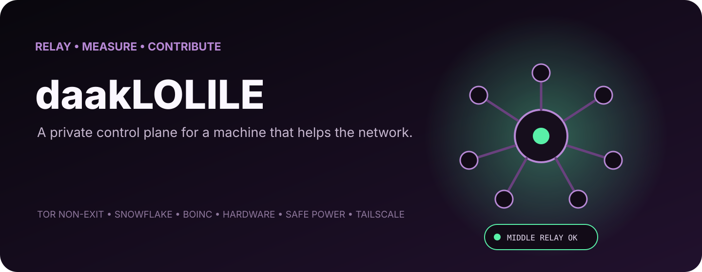
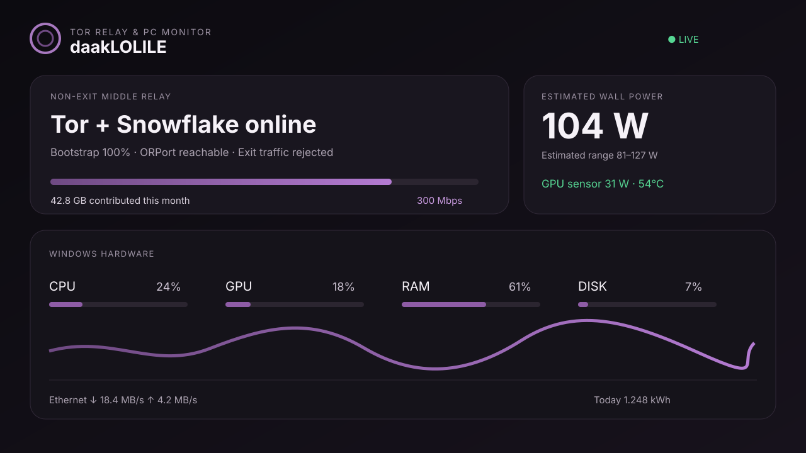

# daakLOLILE

<p align="center">
  
</p>

**A privacy-first Windows Tor relay dashboard, PC hardware monitor, safe power-mode controller, desktop widget, and macOS menu bar companion.**

[Türkçe dokümantasyon](docs/README.tr.md)

[](https://www.microsoft.com/windows/)
[](https://support.apple.com/macos)
[](https://community.torproject.org/relay/)
[](LICENSE)

daakLOLILE combines live Tor middle-relay traffic, Snowflake proxy statistics, Folding@home, BOINC, RIPE Atlas, CPU/GPU/RAM/disk/network telemetry, estimated power use, safe automatic peak-hour power modes, a small Windows desktop widget, and a macOS menu bar app. Remote access and power control are designed for a private [Tailscale](https://tailscale.com/) network.

The compact desktop widget keeps only total support, Tor/Snowflake health, volunteer projects, power mode, CPU, and GPU visible. Two dynamic Windows notification-area icons remain available when the card is hidden: one color-coded health indicator and one enlarged, borderless numeric watt icon sized to fill the native Windows tray slot. Closing the card hides it without ending the background process or either tray icon. Both icons can show or hide the card. Slow Windows-service and Tor-directory checks refresh in the background, so they cannot stall the local panel API or cause false disconnect warnings.



## Why daakLOLILE?

- Monitor a Windows Tor **middle/non-exit relay** without exposing an admin panel to the public internet.
- See relay bandwidth, bootstrap, reachability, consensus status, completed Snowflake sessions, and total contributed traffic. Session totals are not presented as unique people.
- Track CPU, GPU, memory, disks, network throughput, temperatures, component power sensors, and top processes.
- Keep collecting data before logon by running the Windows tasks as `SYSTEM`.
- Check the PC and switch power modes from a Mac menu bar app over Tailscale.
- Track Folding@home work, BOINC projects, and RIPE Atlas measurements without sharing storage.
- Keep the standalone Snowflake proxy available 24/7 with an unrestricted-NAT health check. Completed-session count is demand-driven by the Tor broker, is not a unique-person count, and capacity is a ceiling rather than a target.
- Control BOINC from a constrained SYSTEM console over localhost or Tailscale without exposing arbitrary CMD or PowerShell execution.
- Automatically use an efficient CPU/display profile at night without sleep, hibernation, network shutdown, or service interruption.
- Keep Tor settings localhost-only while allowing the narrow power-mode endpoint from localhost and Tailscale.

## Security model

daakLOLILE does not turn a relay into an exit node. Your Tor configuration should contain:

```text
SocksPort 0
ExitRelay 0
ExitPolicy reject *:*
```

The installer creates an inbound rule for the dashboard port that accepts only Tailscale IPv4 and IPv6 ranges. It does **not** change the Tor ORPort, router forwarding, Tailscale, Remote Desktop, file sharing, or Snowflake configuration.

The API deliberately allows Tor settings changes only from loopback (`127.0.0.1` or `::1`). The separate power endpoint accepts requests only from loopback or Tailscale addresses and can select only the predefined `auto`, `eco`, `balanced`, and `performance` profiles. It cannot execute arbitrary commands or stop services.

The BOINC console is also limited to loopback or Tailscale source addresses and requires an allowed host header, same-origin request, and an in-memory control token. It maps fixed action IDs to bundled BOINC/service operations; it never accepts command text, executable paths, arguments, service names, or scripts from the browser. Every console action is appended to a local audit log without storing command output. Treat relay nickname, fingerprint, public ContactInfo, IP addresses, and logs as potentially sensitive operational information.

## Requirements

- Windows 10/11 x64
- An existing Tor relay installation whose `torrc` is under `C:\ProgramData\TorRelay` by default
- Node.js 22 or newer
- Administrator access for installation
- Optional: Tailscale on Windows and macOS
- Optional: macOS 13 or newer with Apple command-line developer tools

daakLOLILE downloads the pinned official [LibreHardwareMonitor 0.9.6](https://github.com/LibreHardwareMonitor/LibreHardwareMonitor/releases/tag/v0.9.6) archive and verifies its SHA-256 checksum during Windows installation.

## Windows quick start

Download or clone the repository, open PowerShell as Administrator, then run:

```powershell
Set-ExecutionPolicy -Scope Process Bypass
.\windows\install.ps1 -InstallWidget
```

If your Tor files live elsewhere:

```powershell
.\windows\install.ps1 -TorRoot 'D:\TorRelay' -DashboardPort 17657 -InstallWidget
```

Open the local dashboard:

```text
http://127.0.0.1:17657
```

From another device on the same tailnet, use the Windows PC's Tailscale IP:

```text
http://100.x.y.z:17657
```

## macOS menu bar app

1. Install and connect Tailscale on both devices.
2. Copy the `macos` folder to the Mac.
3. In Terminal, run `zsh build.command` from that folder.
4. Enter the Windows PC's Tailscale IP in daakLOLILE and choose **Connect**.
5. Switch between automatic, night-saving, balanced, and high-performance modes from the menu bar.
6. Optionally move `build/daakLOLILE.app` to Applications and add it under **System Settings → General → Login Items**.

The Mac app reads monitoring data and can call only the constrained power-mode endpoint. It does not run a relay or proxy on the Mac and cannot change Tor settings.

## Safe power modes

daakLOLILE creates three dedicated Windows power schemes and an automatic controller:

- **Automatic:** deep eco from `17:00` to `22:00` by default, matching the official T2 peak period; balanced outside that window.
- **Peak saving:** caps CPU maximum state at 35%, disables boost, prefers passive cooling and parked cores, uses maximum PCIe link savings, and allows an idle HDD to spin down after 10 minutes. Folding keeps one CPU thread but disables its GPU temporarily; BOINC keeps a 10% CPU budget. Snowflake remains unrestricted and always on.
- **Balanced:** full CPU range with normal display timing.
- **High performance:** full CPU range and boost with a longer display timeout.

All daakLOLILE schemes explicitly disable sleep, hibernation, and hybrid sleep. They do not power down network adapters or change Tor, Snowflake, Tailscale, Chrome Remote Desktop, RDP, SMB, or Syncthing settings. The peak-saving plan can spin down an idle mechanical disk, which wakes automatically on the next file access. The controller runs as `SYSTEM` before login and checks the schedule every five minutes.

## Safe memory maintenance

Windows normally uses otherwise-idle RAM as a useful file cache, so daakLOLILE does not blindly empty memory on a timer. A daily `04:30` task checks physical-memory pressure without requiring a user login. Automatic trimming happens only when usage is at least 85% and free physical memory is at or below 2 GB.

When intervention is justified, daakLOLILE trims only its own dashboard and monitoring helper processes. Tor, Snowflake, Tailscale, Chrome Remote Desktop, RDP, SMB, Syncthing, other applications, and the Windows file cache are excluded. The dashboard and macOS companion also offer a constrained manual maintenance button over localhost or Tailscale.

## Volunteer science and measurement stack

Run the official client installer from an elevated PowerShell:

```powershell
.\windows\install-volunteer-stack.ps1 -EnableRipeAtlasPrerequisites
.\windows\install.ps1 -InstallWidget
```

- Folding@home runs as `lolile`, uses two CPU threads, can use a supported GPU, and is configured for idle use.
- BOINC runs as a Windows service with conservative limits: 10% CPU in deep eco mode, 33% in other modes, 25–40% RAM, 5 GB disk, and no GPU. A project account still has to be connected by its owner.
- BOINC Manager stays hidden. The `daakLOLILE BOINC Headless Guard` removes Manager autostart entries, blocks interactive execution of `boincmgr.exe`, and rechecks the policy at startup, logon, and every five minutes. BOINC remains controllable from the allow-listed private dashboard console. The daakLOLILE uninstaller restores Manager execution permissions.
- RIPE Atlas is installed from RIPE NCC's official Debian repository inside WSL after the required reboot. Its public key must be registered by the owner at [RIPE Atlas software probe registration](https://atlas.ripe.net/apply/swprobe/).

The RIPE Atlas setup verifies the repository package against the official release checksum, does not require an inbound router port, disables interface traffic reporting, and does not share files or disk space. Account passwords and API keys are never stored in daakLOLILE.

## Power readings and Corsair PSUs

The PSU wattage printed on the label—650 W, 750 W, and so on—is maximum capacity, not continuous consumption.

daakLOLILE uses real component sensors where LibreHardwareMonitor exposes them. It estimates missing CPU/system/PSU losses and labels the total wall-power value as an estimate. A standard PSU has no software data connection. Some digital Corsair RMi/HXi models can expose telemetry through an internal USB connection and iCUE, but daakLOLILE does not currently integrate iCUE.

For accurate whole-PC energy measurement, use a reputable external smart plug or power meter with local API access.

## Electricity bill estimate

The dashboard keeps a 31-day daily ledger plus seven days of hourly samples and estimates the PC's contribution to a standard Istanbul/Şişli residential bill. The bundled July 2026 profile uses the EPDK national low/high residential tiers effective from 4 April 2026, including an approximate tax-inclusive price range.

Because daakLOLILE cannot see the rest of the home's meter, it does not claim a single exact bill amount. It shows the PC contribution as a low-tier/high-tier range, along with today's cost, month-to-date cost, a 30-day run-rate, daily and hourly history, and a PC-only comparison with the 4,000 kWh/year SKTT threshold. Standard single-time residential pricing is the same at every hour; the automatic `17:00–22:00` window is chosen to reduce power during the official T2 peak period, not to claim a cheaper per-kWh rate. Tariffs are time-sensitive; update the constants in `windows/dashboard/server.mjs` when EPDK publishes a new national tariff.

## Data and ports

| Item | Default |
| --- | --- |
| Install directory | `C:\ProgramData\daakLOLILE` |
| Dashboard | TCP `17657` |
| Dashboard exposure | Tailscale ranges only |
| Hardware sampling | Every 2 seconds |
| Browser refresh | Every 5 seconds |
| macOS refresh | Every 10 seconds |
| Default peak-saving schedule | `17:00–22:00` local Windows time |
| Power controller | Startup + every 5 minutes, as `SYSTEM` |
| Memory maintenance | Daily at `04:30`, as `SYSTEM`; pressure-gated |
| Volunteer monitor | Startup + every 5 minutes, as `SYSTEM` |
| Folding@home | 2 CPU threads; idle policy |
| BOINC | 10% CPU in deep eco / 33% otherwise, 5 GB disk, GPU disabled |
| RIPE Atlas | Official Debian package in WSL; no disk sharing |
| Tor root | `C:\ProgramData\TorRelay` |

Energy history and relay traffic counters stay on the Windows PC. No analytics or third-party telemetry is included.

## Uninstall

Run as Administrator:

```powershell
.\windows\uninstall.ps1
```

The uninstaller removes daakLOLILE tasks, its firewall rule, widget shortcut, and installed files. It does not remove Tor, Snowflake, Tailscale, or their data. Use `-KeepData` to keep the daakLOLILE data directory.

## Project layout

```text
windows/
  install.ps1
  uninstall.ps1
  hardware-monitor.ps1
  power-manager.ps1
  memory-manager.ps1
  widget.ps1
  dashboard/
macos/
  Sources/daakLOLILEApp.swift
  build.command
docs/
```

## Contributing

Bug reports, sensor compatibility results, translations, accessibility improvements, and safe integrations for local power meters are welcome. Read [CONTRIBUTING.md](CONTRIBUTING.md) and [SECURITY.md](SECURITY.md) before submitting changes.

## Disclaimer

daakLOLILE is an independent community project. It is not affiliated with or endorsed by The Tor Project, Tailscale, Corsair, or LibreHardwareMonitor. Run relays in accordance with your local laws, ISP terms, and the official Tor relay documentation.

## License

[MIT](LICENSE)
